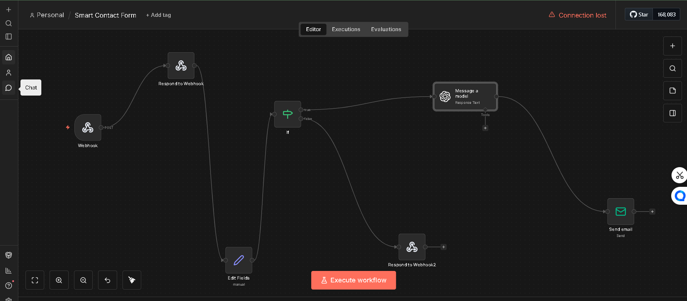
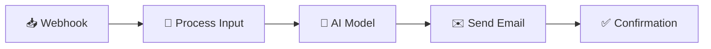

<div align="center">

# 🤖 AI-Powered Email Automation System

[](https://n8n.io/)
[](https://openai.com/)
[](https://gmail.com/)
[](LICENSE)

*An intelligent email generation and delivery system that transforms user input into personalized, AI-crafted emails.*

---

### 🎯 Smart Contact Form Workflow



</div>

---

## ✨ Overview

This project is an **automated email generation and delivery system** built using **n8n** workflow automation and **AI language models**. It seamlessly receives user input via a webhook, generates customized email content using AI, and delivers it automatically through your preferred email provider.

---

## 🚀 Features

| Feature | Description |
|---------|-------------|
| 🧠 **AI-Generated Content** | Intelligent email composition using advanced language models |
| 🎨 **Customizable Output** | Adjustable tone, language, and length parameters |
| 🔗 **Webhook Integration** | Real-time input handling via HTTP webhooks |
| 📧 **Multi-Provider Support** | Compatible with Gmail, SMTP, and Outlook |
| ⚡ **Workflow Automation** | Powered by n8n for seamless orchestration |
| 🎯 **Prompt Engineering** | Fine-tuned prompts for high-quality output |

---

## 🛠️ Tech Stack

<div align="center">

| Technology | Purpose |
|:----------:|:-------:|
|  | Workflow Automation |
|  | AI Language Model |
|  | Input Handling |
|  | Email Delivery |
|  | Workflow Design |

</div>

---

## 📋 Workflow Overview



### Step-by-Step Process:

1. **📥 User Submission** — Data received via webhook (name, email, message)
2. **🔄 Input Processing** — Workflow validates and transforms the input
3. **🧠 AI Generation** — Language model crafts personalized email content
4. **✉️ Email Delivery** — Automated sending to the recipient

---

## 📁 Project Structure

```
AI-powered-email-workflow/
├── 📄 README.md              # Project documentation
├── 📋 Smart Contact Form.json # n8n workflow export
└── 🖼️ image.png              # Workflow visualization
```

---

## 💡 Use Cases

<div align="center">

| Use Case | Description |
|:--------:|:-----------:|
| 📬 **Contact Form Replies** | Automated, intelligent responses to form submissions |
| 🎧 **Customer Support** | AI-powered customer service responses |
| 🔔 **Personalized Notifications** | Tailored email notifications for users |
| 🤖 **Smart Autoresponders** | Context-aware automatic email replies |

</div>

---

## 🚀 Getting Started

### Prerequisites

- [n8n](https://n8n.io/) instance (self-hosted or cloud)
- Email provider credentials (Gmail, SMTP, or Outlook)
- AI API access (OpenAI, Azure OpenAI, etc.)

### Installation

1. **Clone the repository**
   ```bash
   git clone https://github.com/yourusername/AI-powered-email-workflow.git
   ```

2. **Import the workflow**
   - Open your n8n instance
   - Go to **Workflows** → **Import from File**
   - Select `Smart Contact Form.json`

3. **Configure credentials**
   - Set up your email provider credentials
   - Add your AI API key
   - Configure webhook URL

4. **Activate and test**
   - Enable the workflow
   - Send a test request to your webhook

---

## ⚠️ Security Notice

> **Important:** Sensitive data such as API keys and credentials are **not included** in this repository. Please configure your own credentials securely in your n8n instance.

---

## 👤 Author

<div align="center">

**Ghaith Oueslati**

[](https://github.com/ghayth002)
[](https://linkedin.com/in/ghaith-oueslati)

</div>

---

<div align="center">

Made with ❤️ and ☕

⭐ **Star this repo if you find it useful!** ⭐

</div>
